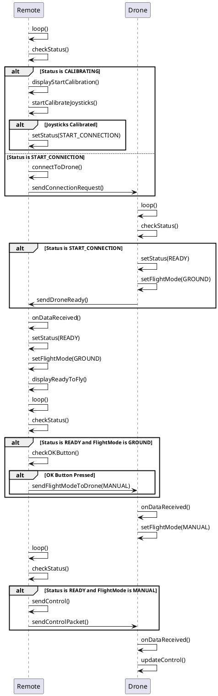

# ESP32 Drone Project
This repository contains the code for a drone built using ESP32 microcontrollers. The project is developed using PlatformIO and includes multiple sensors such as LIDAR, GPS, and IMU. The project is divided into three main components: the drone, the camera, and the remote controller.

## Project Structure
```
ESP32-DRONE/
    .gitignore
    .pio/
    .vscode/
    include/
    lib/
    src/
    test/
ESP32-DRONE-CAM/
    .gitignore
    .pio/
    .vscode/
    include/
    lib/
    src/
    test/
ESP32-DRONE-REMOTE/
    .gitignore
    .pio/
    .vscode/
    include/
    lib/
    src/
    test/
README.md
```

### ESP32-DRONE
This directory contains the main drone code, which interfaces with various sensors and communicates with the remote controller.

#### Main Loop
The main loop in src/main.cpp performs the following tasks:

Report Status: Periodically reports the drone's status.
Update Sensors: Updates the IMU and LIDAR sensor readings at specified intervals.
Display Telemetry: Prints telemetry data to the serial monitor.
Transmit Telemetry: Sends telemetry data to the remote controller via ESP-NOW.

### ESP32-DRONE-CAM
This directory contains the code for the camera module, which captures images and saves them to an SD card.

#### Main Loop
The main loop in src/main.cpp performs the following tasks:

Report Status: Periodically reports the camera's status.
Handle Commands: Listens for commands from the main drone to take pictures and save them to the SD card.

### ESP32-DRONE-REMOTE
This directory contains the code for the remote controller, which communicates with the drone and sends control commands.

#### Main Loop
The main loop in src/main.cpp performs the following tasks:

Calibrate Joysticks: Calibrates the joysticks if not already calibrated.
Connect to Drone: Attempts to connect to the drone and establish communication.
Send Control Commands: Sends control commands to the drone based on joystick inputs.


## Dependencies
This project uses the following libraries:

Adafruit Unified Sensor
TinyGPSPlus
DFRobot LIDAR07
Adafruit BusIO
Wire
LiquidCrystal_I2C
Setup and Installation
Install PlatformIO in your preferred IDE (e.g., VSCode).
Clone this repository.
Open the project folder in your IDE.
Build and upload the project to your ESP32 boards using PlatformIO.
Usage
The main functionality of the project is implemented in the main.cpp files of each component. Each sensor and module has its own setup and measurement functions.

## Sensor Readings
To read the sensors, a Circular Buffer approach is used to maintain a fixed-size array that acts as a queue for storing a limited number of the most recent data points.


